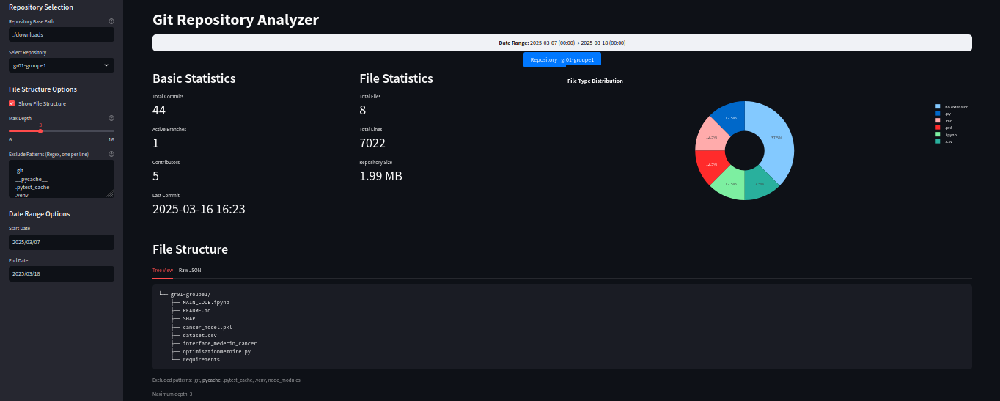
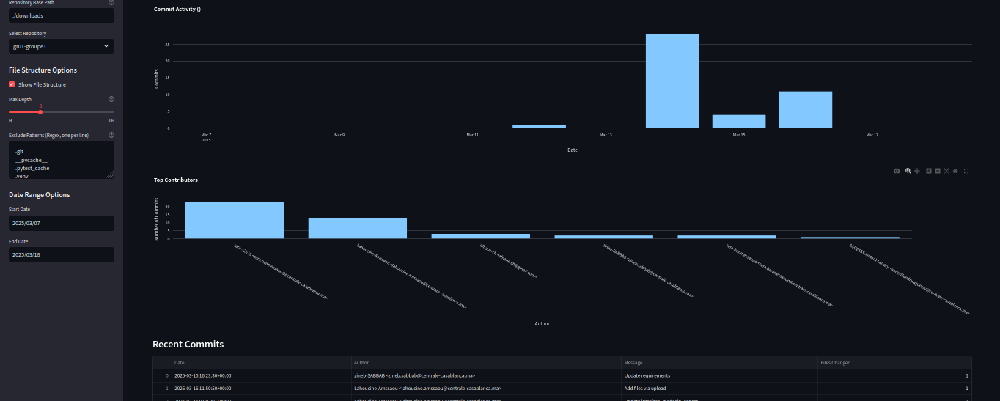

# Git Repository Analyzer


A simple tool for analyzing Git repositories with an interactive Streamlit dashboard. This tool helps you visualize repository statistics, commit history, file structures, and contributor activities.

## Features

- **Repository Analysis**
  - Basic statistics (commits, branches, contributors)
  - File type distribution
  - Repository size tracking
  - Commit history visualization
  - File structure explorer
  - Contributor activity metrics

- **Interactive Dashboard**
  - Date range selection
  - File structure depth control
  - Pattern-based file exclusion
  - Multiple visualization options
  - Responsive design

- **Batch Repository Management** 
  - Automated repository cloning
  - Repository updates
  - Multi-repository support

## Installation

1. Clone this repository:
```bash
git clone https://github.com/hermann-web/git-repo-analyzer.git
cd git-repo-analyzer
```

2. Install dependencies:
```bash
pip install -r requirements.txt
```

## Usage

### 1. Repository Download

Create an `inputs/repos` file with repository URLs:

```text
https://github.com/user/repo1.git
https://github.com/user/repo2.git
```

Run the download script:
```bash
python download.py
```

This will:
- Create a downloads directory
- Clone or update specified repositories
- Organize repos by autoincremented group ID

### 2. Launch Dashboard

Start the Streamlit dashboard:
```bash
streamlit run app.py
```

The dashboard provides:
- Repository selection dropdown
- Date range picker
- File structure controls
- Interactive visualizations

### 3. Analysis Features

- **Basic Statistics**
  - Total commits
  - Active branches
  - Contributor count
  - Repository size
  - Latest commit info

- **File Analysis**
  - File type distribution
  - Total files and lines
  - Interactive file structure explorer

- **Activity Metrics**
  - Commit frequency
  - Author contributions
  - Timeline visualizations

## Project Structure
```
├── app.py # Streamlit dashboard 
├── download.py # Repository downloader
├── src/
│   ├── download_repos.py # Download utilities
│   ├── constants.py # Project constants
│   ├── repo_stats.py # Analysis logic
```

## Screenshots





## Configuration

The tool supports various configuration options:

- File exclusion patterns (e.g., `.git`, `__pycache__`)
- Directory depth control
- Date range selection
- Custom repository grouping

## Contributing

Contributions are welcome! Please feel free to submit pull requests.

## Acknowledgments

- Built with [Streamlit](https://streamlit.io/)
- Uses [GitPython](https://gitpython.readthedocs.io/) for repository handling
- Visualizations powered by [Plotly](https://plotly.com/)
